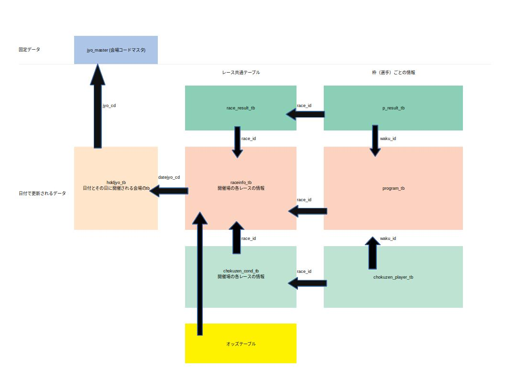

# Let's revenge to the BoatRace

競艇を分析するためのデータ収集用ソースコード

公式サイトの情報をスクレイピングし，mysqlを用いてデータベースを構築する

ただクローンしても動かないので注意（mysqlのサーバーをローカルの別の場所に置いているため）

## このRPでできるリレーショナル・データベース


### 構造


## jupyter labを使う場合(dockerを立ち上げる)

1. 下記makeの実行
2. ブラウザで，localhost:8840にアクセス．

```sh
# jupyter付きコンテナを立てる
make start
# docker内にbashでアクセス
make bash
# コンテナを止める
make stop
# mysqlが起動してない場合
make start_db
```

## pipenvによる実行

```sh
pipenv install
# pythonの実行
pipenv run python src/**/hogehoge.py
# testの実行
pipenv run pytest src/**/test/
```
